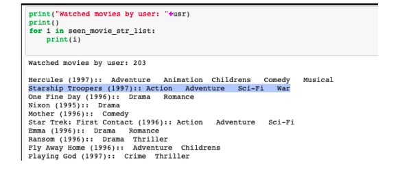
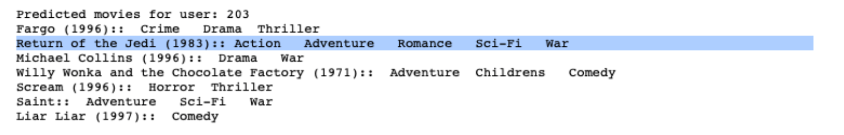

# Team Houdini

## [Netflix_Recommender-Collaborative_Filtering -- Yehuda Koren](https://www.cs.rochester.edu/twiki/pub/Main/HarpSeminar/Factorization_Meets_the_Neighborhood-_a_Multifaceted_Collaborative_Filtering_Model.pdf)

### How to clone this repo 

``` git clone https://github.com/adi-iiith/Netflix_Recommender-Collaborative_Filtering.git ```

### Requirements : 

* Python version - ```3```
* sparse matrix library - ```scipy.sparse```

### Objectives : 

* Implement the paper, reduce the RMSE error for movie prediction and perform better than the currently existing models ( Latent Factor and Nieighbourhood ). 

### [Dataset](https://grouplens.org/datasets/movielens/100k/)

* Use dataset as " ../input/u.data " 

### Results : 

* Movie previously watched by user. 



* Movies predicted. 



* For further explanation refer to ```Team Houdini.pptx``` or ```Team Houdini.pdf```

#### How to Run the project : 

* Save the Dataset in "../input" folder.
* (python v3.x) 
* To train and test Integrated Model :

	--Train model                  -- " python3 integrated_model.py " 
	--Test  model 				   -- " python3 integrated_train.py " 
	( OR )
	-- Train and Test (per epoch ) -- " python3 integrated_model_epoch_error.py"

* To train and test Neighborhood model :
	* Train and Test (per epoch ) -- " python3 neighborhood.py"

* To train and test SVDpp model :
	* Train and Test (per epoch ) -- "python3 svdpp.py"

* Predictions for Integrated model (Demo)
	* test_beta.ipynp

* EDA for Dataset :
	* EDA.ipynp

.. Project Report 

.. Project Presentation 